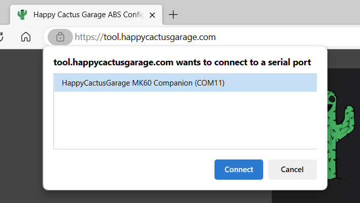

# Connect & Configure

## Connect your controller

### Bluetooth

1. Open Bluetooth pairing for your PC, and pair a new device. Connect to the device called `HCG-Mk60-xx` using the PIN `1234`. NOTE: on Windows, you may have to set "Bluetooth devices discovery" to "Advanced" for the controller to be visible.
1. Navigate to https://tool.happycactusgarage.com/ in Google Chrome or Microsoft Edge
1. Press the `Connect` button, then in the dialog that appears, select the controller. On Windows, the correct device is called `HCG-MK60-xx`. On macOS, the correct device is called `cu.HCG-MK60-xx`.
1. If connection doesn't work, try power cycling the controller and re-pairing Bluetooth.

### USB

<!-- TODO: how to open case -->

1. Connect a USB B cable to the header on the controller. You should see various LEDs flashing.
1. Navigate to https://tool.happycactusgarage.com/ in Google Chrome or Microsoft Edge
1. Press the `Connect` button, then in the dialog that appears, select `HappyCactusGarage MK60 Companion`, and `Connect`.

## Configure your controller

Once connected, you should see sections for information about your device (software version, hardware ID, serial number), the status reported by various systems, and some configuration options.

1. Select the type of ABS controller you're using.
1. If using the PWM speedometer output, configure how many pulses should be output per kilometer traveled. This may require some experimentation to get the scaling right.
1. Rotation direction (MK60E5 only). The defaults here should be correct for an MK60E5 from a BMW E8x/E9x. You'll check that these are set correctly later in the testing section.

## Firmware Update

1. Connect to your controller as described above. Firmware update over Bluetooth will work, but takes several minutes to complete.
1. Press `Reboot to bootloader`, and re-select your device when prompted.
1. When ready, press `Start firmware update`. Over USB, this should take less than 15 seconds, but over Bluetooth it will require several minutes.
1. Once the status shows `Done!`, reboot using the `Reboot to app` button or by power cycling the controller.

Note 1: It may take up to 30 seconds for the controller to be available for connection immediately after a firmware update.

Note 2: During/after a firmware update, it is possible that fault codes may be set on the ABS controller for "wheel sensor electrical fault". So long as they don't come back in normal operation and only happen at the time of a firmware update, this is expected behavior.
