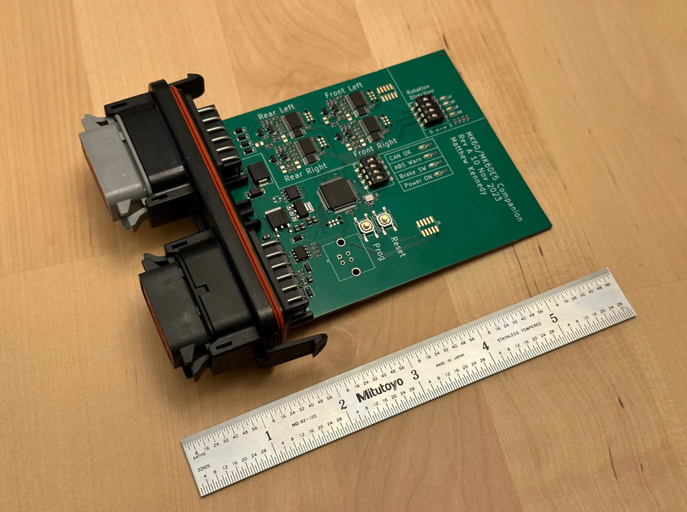

# Mk60 Companion Setup Guide

1. [Wire in the module.](Wiring.md)
1. [Configure the module for your ABS controller and vehicle parameters.](Configuration.md)
1. [Test it!](Testing.md)

## Resources

[Troubleshooting](Troubleshooting.md)

[CAN bus transmit format](CAN-Data.md)

[Discord community](https://discord.gg/mhp6THSr8B)

[Mk60 Companion in the Happy Cactus Garage Store](https://happycactusgarage.com/products/mk60-companion)
